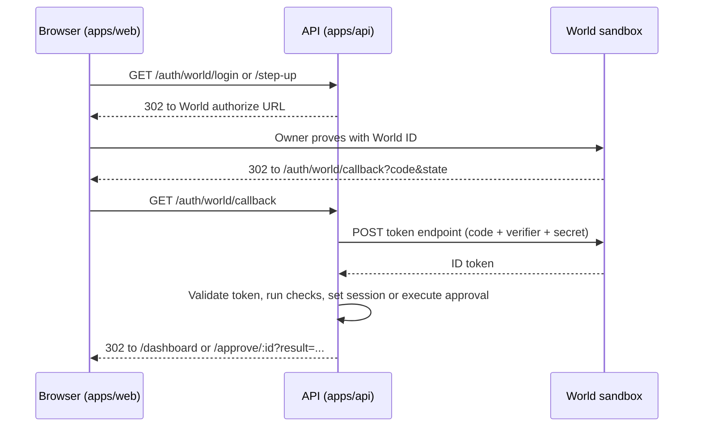

# World ID for Agents — Integration Handover

Sep 26, 2026 · Ankit. Shared copy: https://claude.ai/code/artifact/9fc97fc8-ec07-418b-b3c9-0fdcb0f9b6cc

## Summary

Phase 5 (World ID for Agents) is designed but not built: `packages/integrations/world` is still an empty `.gitkeep`, and no client is registered yet. The next owner starts by registering the sandbox client, because the portal approval is the slowest step.

World ID for Agents is a standard OpenID Connect (OIDC) provider at `https://sandbox.auth.world.org`. AgentPass uses it twice:

1. **Owner sign-in** gives each owner a stable, per-app `sub`, stored as `(iss, sub)` in `users`.
2. **Fresh approval (step-up)** reruns sign-in with `max_age=0` and `nonce = binding_hash`. This proves that this owner, right now, approved this exact payment or rule loosening.

What exists in the repo today:

- `apps/api/src/modules/approvals/` creates approvals and settles x402 payments on approve.
- `POST /approvals/:id/approve` has **no authentication**; for an `X402_PAYMENT` it settles USDC. Phase 5 must replace it.
- There is no `users` table and no owner session.

## Where it lives

Almost everything goes in the backend. World supports only confidential OIDC clients, so the secret, the code exchange and the token checks must run on the server. The frontend only sends the browser to backend URLs and shows the result. IDKit, the browser-side World SDK, is cut from scope.



| Layer | Location | Owns | Must not touch |
| --- | --- | --- | --- |
| OIDC client | `packages/integrations/world` | Discovery, signing keys, authorize URL (PKCE, state, nonce, `max_age`), code exchange, ID token validation, `computeBindingHash`, pure `checkApprovalTicket` | Database, Elysia, policy, executors, signers |
| Web layer | `apps/api/src/modules/auth/` | Routes, signed attempt and session cookies, `session` plugin for owner routes | Settlement logic |
| Approvals | `apps/api/src/modules/approvals/` (exists) | Stores `binding_hash`, runs checks from the callback, then executes via the existing settle path | World protocol details |
| Frontend | `apps/web` | Sign-in link, `/approve/:id` page, result display | Secrets, tokens, World SDKs |

Policy, executors and signers never import the World code. The approvals module is the only piece that connects them. `apps/world-miniapp` stays empty until Phase 8.

## Client registration

Register one confidential client in the sandbox portal before writing callback code. The auth method and the sector can't be changed after registration.

1. Deploy the API skeleton to Railway to get a permanent HTTPS domain.
2. Sign in to `https://sandbox.auth.world.org/portal` with Google. Alternatively, an agent can stage it through the World MCP tool `request_oidc_client_registration`; a human then approves the portal link within 20 minutes.
3. Register the redirect URI exactly (no wildcards; scheme, port and path must match). The sector is the redirect hostname, so localhost and Railway can't share one client without extra setup:
    - **Recommended:** two clients. Production uses `https://<railway-domain>/auth/world/callback`; local uses `http://localhost:3001/auth/world/callback` (sandbox accepts loopback HTTP). Owners get different `sub` values in each, which is fine for local testing.
    - **Alternative:** one client with an HTTPS `sector_identifier_uri` that lists both URIs as a JSON array. That URI's hostname becomes the sector.
4. Choose `client_secret_basic`, the default and simplest. `private_key_jwt` also works but needs a new RS256 assertion on every token call.
5. Copy the secret straight into Railway and the local `.env`. The portal shows it only once.
6. Start a friction log now; the prize requires an integration debrief.

| Choice | Changeable later? | Why it matters |
| --- | --- | --- |
| Client auth method | No | Fixes how the token call authenticates |
| Sector (redirect hostname) | No | Changing it gives every owner a new `sub`, breaking existing accounts |
| Redirect URIs | Yes, within the same sector | Exact match required |
| Secret | Rotate via portal | Keep the old one active until the new one works |

## Secrets and environment

World secrets live only in Railway variables (production) and the git-ignored root `.env` (local). `apps/api/src/env.ts` loads `.env` but never overrides a variable that's already set, so Railway wins.

| Variable | Secret | Railway | Local `.env` | Notes |
| --- | --- | --- | --- | --- |
| `WORLD_OIDC_ISSUER` | No | Yes | Yes | `https://sandbox.auth.world.org` |
| `WORLD_CLIENT_ID` | No | Yes | Yes | Different per client if you use two |
| `WORLD_REDIRECT_URI` | No | Yes | Yes | Must match the registered URI exactly |
| `WORLD_CLIENT_SECRET` | Yes | Yes | Yes | Shown once in the portal; or `WORLD_CLIENT_PRIVATE_KEY` for `private_key_jwt` |
| `COOKIE_SECRET` | Yes | Yes | Yes | Signs attempt and session cookies; `openssl rand -base64 32` |

Never put these values in:

- Any `VITE_*` variable or the React build (they become public JavaScript)
- The database, code, logs, or chat
- The public repo (turn on GitHub secret-scanning push protection)

`.env.example` needs a fix: its Phase 5 block lists `WORLD_APP_ID` and `WORLD_ACTION`, which belong to the older IDKit flow. Replace them with:

```
# Phase 5 — World ID for Agents (OpenID Connect, backend only)
WORLD_OIDC_ISSUER=https://sandbox.auth.world.org
# WORLD_CLIENT_ID=
# WORLD_REDIRECT_URI=http://localhost:3001/auth/world/callback
# Secret, shown once in the portal. Set it here locally and in Railway. Never VITE_.
# WORLD_CLIENT_SECRET=
# Signs the sign-in and session cookies. Generate with: openssl rand -base64 32
# COOKIE_SECRET=
```

## Backend implementation

Build the OIDC client first, then sign-in, then step-up, then remove the unauthenticated approve route.

### World package API

`packages/integrations/world` uses **openid-client v6** (named in `planning-v2.md`) and exports:

| Function | Returns | Notes |
| --- | --- | --- |
| `buildAuthorizeUrl(cfg, { nonce?, fresh? })` | `{ url, state, nonce, verifier }` | `scope=openid` exactly; S256 PKCE; `fresh` adds `max_age=0` and `acr_values=https://world.org/oidc/acr/orb-v3` |
| `redeemCode(cfg, code, verifier, expectedNonce)` | `{ iss, sub, authTime, acr }` | Validates RS256 signature, `iss`, `aud`, `exp`, `nonce`; requires `auth_time` |
| `computeBindingHash(approval)` | hex string | `sha256(approval_id \| agent \| amount \| token \| payTo \| expires_at)`; for rule changes, hash the proposed rules |
| `checkApprovalTicket(identity, approval, owner, startedAt)` | ok or failure code | Pure; no database |

World facts that shape the code:

- There's no UserInfo endpoint and no refresh token. All claims come from the ID token.
- Codes and ID tokens last 5 minutes. A code works once, so never retry an exchange that may have succeeded.
- Check freshness with `auth_time`, never `iat`.
- Never log token bodies, Authorization headers or callback query strings.

### Auth routes (`apps/api/src/modules/auth/`)

| Route | Auth | Does |
| --- | --- | --- |
| `GET /auth/world/login` | none | Build URL, set attempt cookie (`kind: login`), 302 to World |
| `GET /auth/world/step-up?approval=:id` | session | Owner owns the approval and it's pending; set `step_up_started_at`; build URL with `nonce = binding_hash`, `fresh: true`; attempt cookie (`kind: step-up`); 302 |
| `GET /auth/world/callback` | attempt cookie | See callback steps below |
| `POST /auth/logout` | session | Clear session cookie |
| `GET /api/me` | session | Current owner, for the frontend |

The **attempt cookie** is signed, http-only, `SameSite=Lax`, about 10 minutes, and holds `{ kind, state, nonce, verifier, approvalId?, startedAt }`. The **session cookie** is signed, http-only, secure and `SameSite=Lax`.

Callback steps:

1. If `?error=` is present (for example, the owner cancelled): for step-up, mark the approval `cancelled`; redirect.
2. Compare `state` with the cookie in constant time; reject on mismatch. Delete the cookie either way.
3. `redeemCode` with the cookie's verifier and nonce.
4. Login: upsert `users (iss, sub)`, set the session, redirect to `/dashboard`.
5. Step-up: run the approval checks, execute on success, redirect to `/approve/:id?result=...`.

### Database migration

```sql
CREATE TABLE users (
  id uuid PRIMARY KEY,
  world_iss text NOT NULL,
  world_sub text NOT NULL,
  created_at timestamptz NOT NULL DEFAULT now(),
  UNIQUE (world_iss, world_sub)
);
ALTER TABLE agents    ADD COLUMN owner_id uuid REFERENCES users(id);
ALTER TABLE approvals ADD COLUMN binding_hash text,
                      ADD COLUMN step_up_started_at timestamptz,
                      ADD COLUMN failure_reason text;
```

### Approval checks

Run these in order on the server after reloading the approval from the database. The first failure stops execution, releases the reservation and writes the ledger.

| Order | Check | Failure status |
| --- | --- | --- |
| 1 | Approval is still `pending` | rejected (no state change) |
| 2 | `expires_at` is in the future | `expired` |
| 3 | Cookie nonce equals stored `binding_hash` (token nonce already matched the cookie) | `failed: BINDING` |
| 4 | Token `(iss, sub)` equals the agent owner's | `failed: WRONG_HUMAN` |
| 5 | `auth_time` ≥ `step_up_started_at` − 30 s and ≤ now + 30 s | `failed: STALE_VERIFICATION` |
| 6 | Execute payment or rule write | `paid` / `applied`, or `failed: QUOTE_CHANGED` / `PAYMENT_FAILED` |

Check 5 compares against the step-up start, not the approval's creation. World recommends this for `max_age=0`, and it's stricter.

### Lock down the existing approval routes

In `apps/api/src/modules/approvals/routes.ts`:

- **Remove** `POST /approvals/:id/approve`. Approval happens only through the step-up callback.
- Remove deny too. Deny also goes through the World step-up, with `decision=deny`.
- The agent-facing `GET /api/v1/approvals/:id` stays read-only behind the agent key.

## Frontend implementation

The frontend has no World package, no World variables and no token handling; it links to backend routes and shows outcomes.

- **Sign-in button:** a plain `<a href="/auth/world/login">`. It must be a full-page redirect, not `fetch`.
- **Who's signed in:** the session cookie is http-only, so call `GET /api/me`.
- **`/approve/:id` page:** show amount, seller, recipient, purpose and expiry countdown.
    - Approve is a link to `/auth/world/step-up?approval=:id`.
    - Deny is a link to `/auth/world/step-up?approval=:id&decision=deny`. It needs a fresh World ID proof too (see `decisions.md`).
    - On return, read `?result=paid|wrong_human|stale|expired|cancelled` and show the outcome.
- **Dev proxy:** Vite on 5173 forwards both `/api` and `/auth` to the API on 3001, so cookies stay first-party.

## Acceptance tests

These ten cases cover the World ID for Agents track: sign-in, fresh approval, and the deny, expire and wrong-person paths, all checked on the server.

| Test | Expected |
| --- | --- |
| Sign in twice with the same World account | Same `users` row |
| Approve within 5 minutes | `paid`; ledger shows the World-bound approval |
| Deny with World ID | `REJECTED`; no money moves |
| Use a deny proof to approve | `failed: BINDING` |
| Wait more than 5 minutes, then approve | `expired` |
| Cancel on the World screen | `cancelled` |
| Complete step-up as a different World account | `failed: WRONG_HUMAN` |
| Replay an old callback URL | Rejected (attempt cookie gone, code already used) |
| Change the amount after the approval was created | Binding hash mismatch; rejected |
| Owner already has a live World browser session | Still forced to a fresh proof; newer `auth_time` |

## Open decisions and corrections

One decision is still open and belongs to Ankit: whether World ID is also the owner's login.

- `decisions.md` currently says World is only the step-up, not the login. `planning-v2.md` assumes World sign-in, and `continuation.md` leaves it to Ankit.
- **Recommendation:** make World the login. The wrong-person check needs the owner's `sub` stored before the first approval, and sign-in stores it for free.
- If accepted, add a dated `decisions.md` entry that supersedes the old one. If rejected, design a separate step that links each owner to their World `sub`.

Corrections to `planning-v2.md`, checked against World's official OIDC and step-up guides:

| Architecture doc says | World's guide says | Action |
| --- | --- | --- |
| Sandbox rejects plain-HTTP localhost; use a tunnel | Registered HTTP loopback callbacks are accepted | Register a localhost client; no tunnel needed |
| Use `max_age=0` or `prompt=login`, whichever is supported | Both are supported | Use `max_age=0` plus `acr_values=https://world.org/oidc/acr/orb-v3` |
| `STALE_VERIFICATION` when `auth_time` is older than the approval | For `max_age=0`, tie `auth_time` to the attempt's start | Compare against `step_up_started_at` |
| `.env.example` lists `WORLD_APP_ID`, `WORLD_ACTION` | Those are IDKit fields | Replace with the OIDC variables above |

## Build order

- [x] Decide whether World is the login; record it in `decisions.md`
- [ ] Register the sandbox client(s); set Railway and `.env` variables (`.env.example` fixed)
- [x] `packages/integrations/world` (no unit tests, per the hackathon decision; checks run against Postgres by script)
- [x] `users` migration, `/auth/world/login`, callback login branch, session plugin; live round trip still to test
- [x] `binding_hash` on approvals, `/auth/world/step-up`, callback step-up branch
- [x] Remove the unauthenticated approve route; put the session on owner routes
- [x] Web sign-in link, `/api/me`, `/approve/:id` page, Vite `/auth` proxy
- [ ] Run the ten acceptance tests
- [x] Update `docs/agent/current-state.md` (phase 5 row and testing section)
- [ ] Write the integration debrief from the friction log

## References

- [World ID for Agents sandbox docs](https://sandbox.auth.world.org/docs)
- [Sandbox developer portal](https://sandbox.auth.world.org/portal)
- [Discovery document](https://sandbox.auth.world.org/.well-known/openid-configuration)
- [World ID agent plugin](https://github.com/worldcoin/world-id-agent-plugin)
- World MCP guides `oidc` and `step-up` (served at `https://sandbox.auth.world.org/mcp`)
- [OIDC Core](https://openid.net/specs/openid-connect-core-1_0.html)
